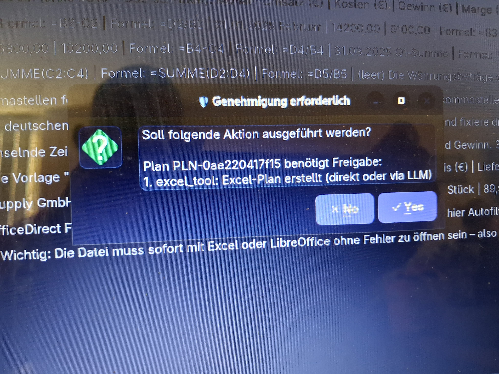
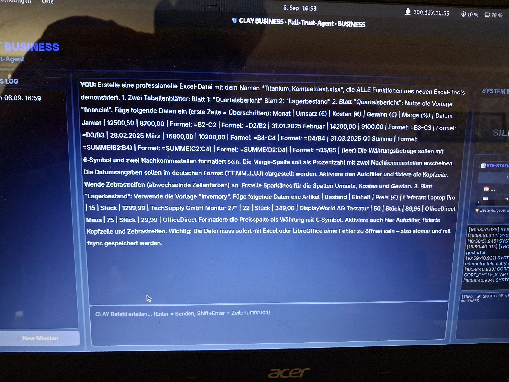
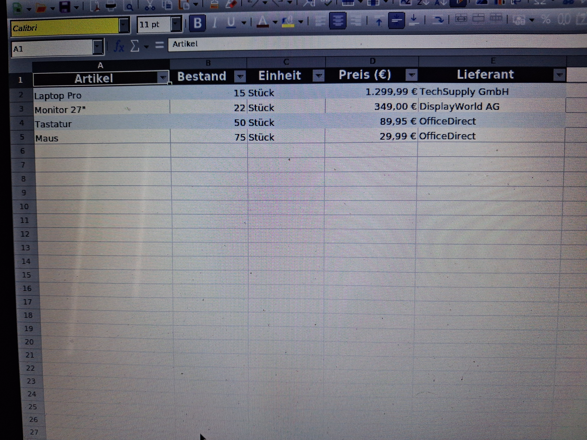

# 🛡️ Silicon Velten – Full-Trust Enterprise Agent „Clay“

### Local-First AI Agent for Controlled Business Automation

**Silicon Velten – Clay** ist ein modularer KI-Agent für die Automatisierung komplexer Geschäftsprozesse.

Clay verbindet ein lokal betriebenes Large Language Model (LLM) mit einer kontrollierten Agentenarchitektur aus **Planning, Memory, Tool Execution, Policy Enforcement, Approval Workflows, Human-in-the-Loop, Audit Logging und Remote Approval**.

Der zentrale Architekturgedanke lautet:

> **Das LLM darf planen – die Anwendung kontrolliert die Ausführung.**

Clay wurde mit dem Ziel entwickelt, die Möglichkeiten moderner KI-Agenten mit **Kontrolle, Nachvollziehbarkeit, lokaler Verarbeitung und kontrollierter Tool-Ausführung** zu verbinden.

---

# 🎥 Live Demo

## ▶️ Clay in Aktion

[](https://www.youtube.com/watch?v=XXVy7oCdnh0)

**Zum vollständigen Demo-Video auf YouTube klicken.**

Im Video wird unter anderem gezeigt, wie Clay:

* eine Aufgabe analysiert
* einen Arbeitsablauf plant
* eine Web-Recherche durchführt
* Informationen verarbeitet
* ein PDF erzeugt
* eine E-Mail vorbereitet bzw. versendet
* Werkzeuge kontrolliert ausführt

**YouTube:**
https://www.youtube.com/watch?v=XXVy7oCdnh0

---

# 🎯 Motivation

Viele moderne KI-Assistenten werden als Cloud-Dienste betrieben. Unternehmen müssen dadurch unter anderem folgende Fragen berücksichtigen:

* Wo werden Unternehmensdaten verarbeitet?
* Welche Daten verlassen die eigene Infrastruktur?
* Welche externen Dienste werden benötigt?
* Welche laufenden API- oder Tokenkosten entstehen?
* Welche Aktionen darf ein autonomer Agent tatsächlich ausführen?
* Wie lässt sich eine KI-Aktion nachvollziehen?
* Was passiert bei Fehlern oder manipulierten Eingaben?

Silicon Velten verfolgt deshalb einen **Local-First-Ansatz**.

Die eigentliche KI-Inferenz kann auf eigener Hardware betrieben werden. Dadurch können sensible Arbeitsabläufe und Unternehmensdaten innerhalb der eigenen Infrastruktur verarbeitet werden, ohne dass für die eigentliche LLM-Inferenz zwingend ein externer KI-Cloud-Dienst erforderlich ist.

Externe Dienste können optional eingebunden werden, beispielsweise für bestimmte Web-Recherche-Funktionen.

---

# 🧠 Was ist Clay?

Clay ist **kein einfacher Chatbot**.

Das System besteht aus mehreren spezialisierten Komponenten, die gemeinsam einen kontrollierten Agenten-Workflow bilden.

```text
                         Benutzer
                            │
                            ▼
                   ┌────────────────┐
                   │    PySide6     │
                   │      GUI       │
                   └───────┬────────┘
                           │
                           ▼
                 ┌────────────────────┐
                 │ Approval / HITL    │
                 │ Human-in-the-Loop  │
                 └─────────┬──────────┘
                           │
                           ▼
                   ┌──────────────┐
                   │  SmartCore   │
                   └──────┬───────┘
                          │
              ┌───────────┼───────────┐
              ▼           ▼           ▼
           Planner      Memory      Policy
              │           │           │
              └───────────┼───────────┘
                          ▼
                   ┌──────────────┐
                   │   Executor   │
                   └──────┬───────┘
                          │
                   ┌──────▼───────┐
                   │ Tool Registry│
                   └──────┬───────┘
                          │
            ┌─────────────┼─────────────┐
            ▼             ▼             ▼
           Web           PDF           E-Mail
            │             │             │
            └─────────────┼─────────────┘
                          ▼
                  Audit / Telemetry
```

---

# 🔐 Full-Trust bedeutet nicht blindes Vertrauen

Der Begriff **Full-Trust Agent** bedeutet ausdrücklich nicht, dass dem Sprachmodell blind vertraut wird.

Im Gegenteil:

Clay trennt die **Intelligenz des LLM** von der **kontrollierten Ausführung durch die Anwendung**.

Vereinfacht:

```text
Benutzeranfrage
       ↓
LLM / Analyse
       ↓
Plan
       ↓
Policy Evaluation
       ↓
Approval / Human Review
       ↓
kontrollierte Ausführung
       ↓
Tool
       ↓
Ergebnis
       ↓
Audit / Telemetry
```

Das Modell ist somit nicht automatisch die letzte Instanz über eine Aktion.

---

# 🛡️ Human-in-the-Loop

Eine der wichtigsten Funktionen von Clay ist die menschliche Kontrolle kritischer Aktionen.

Der Agent kann zunächst einen vollständigen Plan erstellen.

Vor einer freigabepflichtigen Aktion kann der Benutzer den Ablauf prüfen und entscheiden, ob die Aktion ausgeführt werden darf.

Beispielsweise:

```text
Aufgabe:
"Erstelle einen Bericht und sende ihn per E-Mail."

Clay:

1. Aufgabe analysieren
2. Recherche durchführen
3. Daten verarbeiten
4. PDF erstellen
5. E-Mail vorbereiten
6. Versand zur Freigabe vorlegen
7. Nach Freigabe versenden
8. Vorgang protokollieren
```

Dadurch bleibt der Mensch bei kritischen Aktionen in der Entscheidungskette.

---

# 🔐 Policy Engine

Clay besitzt eine eigene Policy- und Kontrollschicht.

Die Grundidee:

> **Nicht jede vom LLM vorgeschlagene Aktion darf automatisch ausgeführt werden.**

Aktionen können anhand ihrer Kritikalität unterschiedlich behandelt werden.

Beispiel:

```text
READ_FILE        → SAFE
WRITE_FILE       → SENSITIVE
SEND_EMAIL       → APPROVAL
DELETE_FILE      → CRITICAL
SHELL_EXECUTION  → RESTRICTED
```

Die Policy Engine befindet sich damit außerhalb des Sprachmodells.

---

# 🧱 Sicherheitsarchitektur

Die Architektur kombiniert mehrere Kontrollmechanismen:

### Policy Enforcement

Regeln bestimmen, welche Aktionen erlaubt, eingeschränkt oder freigabepflichtig sind.

### Human-in-the-Loop

Kritische Aktionen können eine explizite menschliche Freigabe verlangen.

### Tool Isolation

Werkzeuge können getrennt bzw. kontrolliert ausgeführt werden.

### Audit Logging

Aktionen und Ergebnisse werden protokolliert.

### Circuit Breaker / Recovery

Fehlerhafte oder unerwartete Abläufe können kontrolliert beendet bzw. in Recovery-Prozesse überführt werden.

### Private Network Communication

Agent und Modellserver können über ein privates Netzwerk miteinander kommunizieren.

### Remote Approval

Freigaben können über die Mobile Bridge auch von einem separaten Gerät aus erfolgen.

---

# ⚠️ Threat Model

Clay berücksichtigt bei der Architektur nicht nur normale Programmfehler, sondern auch mögliche Angriffs- und Manipulationsszenarien.

## Prompt Injection

Externe Inhalte könnten versuchen, die Instruktionen des Agenten zu verändern.

Mögliche Gegenmaßnahmen:

* Trennung von Daten und Steuerlogik
* Policy Enforcement außerhalb des LLM
* kontrollierte Tools
* Approval für kritische Aktionen

## Manipulierte Webseiten

Webseiten können absichtlich oder unabsichtlich schädliche bzw. irreführende Instruktionen enthalten.

Mögliche Gegenmaßnahmen:

* Zugriff über definierte Tools
* kontrollierte Verarbeitung
* keine automatische Vertrauensannahme gegenüber Webseiteninhalten

## Manipulierte Dokumente

PDFs, Dateien und andere Datenquellen können manipulierte Inhalte enthalten.

Mögliche Gegenmaßnahmen:

* kontrollierte Verarbeitung
* Tool-Isolation
* Validierung
* Logging

## Kompromittierte Tools

Ein Tool kann fehlerhaft oder unerwartet reagieren.

Mögliche Gegenmaßnahmen:

* Tool Registry
* kontrollierte Ausführung
* Prozessisolation
* Policies
* Audit Logging

## Missbrauch privilegierter Aktionen

Besonders kritische Systemaktionen sollen nicht ausschließlich vom LLM entschieden werden.

Mögliche Gegenmaßnahmen:

* abgestufte Berechtigungen
* Approval Workflow
* Human-in-the-Loop
* Circuit Breaker
* Audit Trail

## Kompromittierter Modellserver

Die Architektur trennt das Sprachmodell von der eigentlichen Ausführungslogik.

Das Modell besitzt dadurch nicht automatisch sämtliche Systemrechte des Agenten.

---

# 🧠 Agent Architecture

## SmartCore

SmartCore bildet das zentrale Steuerungssystem von Clay.

Unter anderem verantwortlich für:

* Ablaufsteuerung
* Kontextverwaltung
* Tool-Auswahl
* Policy Integration
* Fehlerbehandlung
* Kommunikation zwischen Komponenten

---

## Planner

Der Planner zerlegt natürliche Sprache in strukturierte Arbeitsschritte.

Beispiel:

```text
Aufgabe
   ↓
Analyse
   ↓
Plan
   ├── Recherche
   ├── Datenverarbeitung
   ├── Dokumenterstellung
   └── Kommunikation
```

---

## Executor

Der Executor ist für die kontrollierte Durchführung genehmigter Arbeitsschritte verantwortlich.

Er verbindet den vom Planner erzeugten Ablauf mit den eigentlichen Tools.

---

## Memory

Clay verfügt über persistente Speicher- und Kontextmechanismen.

Dazu gehören unter anderem:

* kurzfristiger Kontext
* langfristige Informationen
* vergangene Ausführungen
* Reflexionen
* Regeln
* Ergebnisse

---

## Tool Registry

Die Tool Registry verwaltet verfügbare Werkzeuge zentral.

Dadurch können zusätzliche Tools integriert werden, ohne die komplette Kernarchitektur verändern zu müssen.

---

# 🛠️ Tool Ecosystem

Clay besitzt eine erweiterbare Tool-Landschaft.

## Web & Research

* Web Search
* DuckDuckGo
* Tavily
* Playwright
* Universal Fetcher
* Recherche- und Informationswerkzeuge

## Dokumente

* PDF-Erstellung
* Excel-Berichte
* Rechnungen
* Dokumentenverarbeitung

## Kommunikation

* E-Mail
* Benachrichtigungen
* Audit Trail

## Datenzugriff

* SQL-Datenbanken
* Dateisystem
* Datenverarbeitung

## Business Automation

* HR-bezogene Funktionen
* Logistik
* Finanzinformationen
* externe Informationsdienste

## Development

* Code Tool
* Dependency Checks
* kontrollierte Shell-Ausführung

---

# 🌐 Local LLM Architecture

Eine der Besonderheiten von Silicon Velten ist die Trennung zwischen **Agent und Modellserver**.

Der Agent kann auf einem Linux-System betrieben werden, während die eigentliche LLM-Inferenz auf einem leistungsfähigen Windows-Rechner erfolgt.

Beispiel:

```text
┌──────────────────────┐
│      Kali Linux      │
│                      │
│  Clay Agent          │
│  SmartCore           │
│  Planner             │
│  Executor            │
│  Policy              │
│  Approval            │
│  GUI                 │
└──────────┬───────────┘
           │
           │ Private Network
           │ Tailscale
           ▼
┌──────────────────────┐
│   Windows Machine    │
│                      │
│      LM Studio       │
│          │           │
│          ▼           │
│     Local LLM        │
└──────────────────────┘
```

Dadurch kann Clay die Rechenleistung eines leistungsfähigen Systems nutzen, ohne dass der Agent selbst über entsprechende GPU-Ressourcen verfügen muss.

---

# 🤖 Lokales 14B-LLM

Clay wurde für lokale Sprachmodelle entwickelt und kann beispielsweise mit einem **14B-Modell** betrieben werden.

Die Modellinferenz erfolgt dabei über **LM Studio**.

Der Agent selbst arbeitet über die bereitgestellte API mit dem Modellserver.

Dadurch entsteht eine klare Trennung zwischen:

```text
Agent Software
      │
      ▼
LLM API
      │
      ▼
Lokales Sprachmodell
```

---

# 💰 Local Inference & Kostenkontrolle

Ein wesentliches Ziel des Local-First-Ansatzes ist die Unabhängigkeit von nutzungsabhängigen Cloud-Tokenkosten für die eigentliche LLM-Inferenz.

Bei lokaler Inferenz entstehen keine API-Gebühren pro Token.

Natürlich entstehen weiterhin reale Kosten für:

* Hardware
* Strom
* Wartung
* Speicher
* Netzwerk
* optionale externe Dienste

Der Vorteil liegt damit insbesondere in **Kostenkontrolle, Unabhängigkeit und Datenhoheit**.

---

# 📊 Telemetry & ROI

Clay besitzt Telemetrie- und Logging-Funktionen zur Nachvollziehbarkeit von Tool-Aktionen und Arbeitsabläufen.

Je nach Workflow können beispielsweise erfasst werden:

```text
Task
Zeitaufwand Mensch
automatisierter Aufwand
Ausführungsstatus
Tool-Nutzung
Fehler
Betriebskosten
geschätzte Zeitersparnis
```

Der ROI-Ansatz soll sichtbar machen, welchen wirtschaftlichen Nutzen automatisierte Prozesse haben können.

Beispiel:

```text
Manuelle Bearbeitung:       45 Minuten
Automatisierte Bearbeitung:  8 Minuten

Zeitersparnis:              37 Minuten
```

---

# 🧠 Learning & Adaptation

Clay besitzt Mechanismen zur Verarbeitung vergangener Ausführungen und Fehler.

Vergangene Ergebnisse können genutzt werden, um zukünftige Abläufe gezielter zu gestalten.

Beispielsweise können berücksichtigt werden:

* vergangene Fehler
* erfolgreiche Strategien
* Tool-Ergebnisse
* Ausführungsverläufe
* Regeln
* Reflexionen

Der Lernmechanismus ersetzt dabei nicht die Policy- und Kontrollschicht.

---

# 🖥️ GUI & Monitoring

Clay besitzt eine **PySide6-basierte grafische Benutzeroberfläche**.

Die Oberfläche kann unter anderem darstellen:

* Benutzeranfragen
* generierte Pläne
* Ausführungsstatus
* Ergebnisse
* Genehmigungsdialoge
* Logs
* Timeline
* Tool-Aktivitäten

Der Benutzer soll dadurch jederzeit erkennen können, was Clay gerade plant bzw. ausführt.

---

# 🎬 Demo Workflow

Das aktuelle Demo-Video zeigt einen vollständigen Beispielworkflow:

```text
Benutzeranfrage
      ↓
Planung
      ↓
Web-Recherche
      ↓
Datenverarbeitung
      ↓
PDF-Erstellung
      ↓
E-Mail
      ↓
Kontrollierte Ausführung
```

### ▶️ Demo ansehen

**YouTube:**
https://www.youtube.com/watch?v=XXVy7oCdnh0

[](https://www.youtube.com/watch?v=XXVy7oCdnh0)

---

# 🖼️ Screenshots

## Aufgabenstellung


## Generierter Excel-Bericht



## Human-in-the-Loop – Approval


---

# 📁 Projektstruktur

```text
Silicon-Velten-Full-Trust-Agent/
│
├── agent/
│   ├── core/
│   │   ├── SmartCore
│   │   ├── Planner
│   │   ├── Events
│   │   └── Types
│   │
│   ├── executor/
│   │   ├── Runner
│   │   ├── Sandbox
│   │   ├── Tool Gateway
│   │   └── Recovery
│   │
│   ├── tools/
│   │   └── Business & System Tools
│   │
│   ├── approval/
│   │   ├── Human-in-the-Loop
│   │   └── Mobile Bridge
│   │
│   ├── models/
│   │   ├── LM Studio Integration
│   │   └── Prompt Strategy
│   │
│   ├── memory/
│   │   ├── Core Memory
│   │   ├── Reflection
│   │   └── Rules
│   │
│   ├── registry/
│   │   └── Tool Registry
│   │
│   └── gui/
│       └── PySide6 Interface
│
├── assets/
├── logs/
├── output/
├── requirements.txt
├── README.md
├── aufgabe.jpg
├── excel.jpg
├── popup.jpg
└── demo.mp4
```

---

# 📚 Technical Documentation

Das Projekt soll langfristig in mehrere technische Dokumentationsbereiche aufgeteilt werden:

```text
docs/
│
├── ARCHITECTURE.md
├── SECURITY.md
├── THREAT_MODEL.md
├── DEMO.md
└── DESIGN_DECISIONS.md
```

## ARCHITECTURE.md

Beschreibung der Komponenten, Abhängigkeiten und Datenflüsse.

## SECURITY.md

Dokumentation der Sicherheitsprinzipien, Policies, Berechtigungen und Kontrollmechanismen.

## THREAT_MODEL.md

Beschreibung relevanter Angriffs- und Fehlerszenarien.

## DEMO.md

Reproduzierbare Beschreibung der Demo-Workflows.

## DESIGN_DECISIONS.md

Dokumentation wichtiger Architekturentscheidungen und ihrer technischen Begründung.

---

# 🔒 Datenschutz & Datenhoheit

Silicon Velten verfolgt einen **Local-First-Ansatz**.

Die Architektur ist darauf ausgelegt, die eigentliche KI-Inferenz und die Verarbeitung geschäftlicher Daten innerhalb der eigenen Infrastruktur durchführen zu können.

Werden externe Dienste eingebunden, beispielsweise für Web-Recherche, hängt der tatsächliche Datenfluss von der jeweiligen Konfiguration und dem verwendeten Dienst ab.

Deshalb gilt:

> **Local-First ist ein technisches Architekturprinzip und keine automatische rechtliche Garantie.**

Die konkrete datenschutzrechtliche Bewertung hängt immer vom jeweiligen Einsatzszenario, den eingesetzten Diensten und der Konfiguration des Systems ab.

---

# 🏢 Mögliche Einsatzbereiche

Die Architektur kann grundsätzlich für zahlreiche Unternehmensprozesse eingesetzt werden.

Beispiele:

* Web-Recherche
* Dokumentenanalyse
* Berichtserstellung
* PDF-Erstellung
* Excel-Verarbeitung
* E-Mail-Automatisierung
* interne Wissenssysteme
* Datenverarbeitung
* administrative Prozesse
* wiederkehrende Business-Workflows

Der Fokus liegt dabei auf:

> **kontrollierter Automatisierung statt unkontrollierter Autonomie.**

---

# 🧪 Entwicklungsphilosophie

### Control over Autonomy

Kontrollierte Ausführung ist wichtiger als maximale Autonomie.

### Local First

Lokale KI-Inferenz, wann immer technisch sinnvoll.

### Human in the Loop

Menschen bleiben bei kritischen Aktionen in der Entscheidungskette.

### Observable Systems

Aktionen und Ergebnisse sollen nachvollziehbar sein.

### Modular Architecture

Neue Komponenten und Tools sollen integriert werden können, ohne das gesamte System neu entwickeln zu müssen.

### Security by Design

Sicherheitsmechanismen sollen Bestandteil der Architektur sein und nicht nur nachträglich hinzugefügt werden.

---

# 🏗️ Projektstatus

**Silicon Velten / Clay befindet sich in aktiver Entwicklung.**

Das Projekt wird kontinuierlich erweitert und verbessert.

Aktuelle Schwerpunkte:

* Agent Architecture
* Planner
* SmartCore
* Executor
* Tool Ecosystem
* Human-in-the-Loop
* Policy Engine
* Memory
* Telemetry
* Local LLM Integration
* Web Research
* Business Automation
* Security

---

# 📜 License

**Silicon Velten / Clay ist proprietäre Software.**

Der Quellcode, die Architektur und die zugehörigen Komponenten sind geistiges Eigentum des Projektautors.

Eine Nutzung, Vervielfältigung, Weitergabe, Modifikation oder kommerzielle Verwendung ist ohne entsprechende Genehmigung bzw. Lizenz nicht gestattet.

---

# 👨‍💻 Project

**Silicon Velten – Full-Trust Enterprise Agent „Clay“**

Developed in Germany.

### Built around one principle:

> **AI should be powerful enough to help — and controlled enough to trust.**

---

## 🎥 Demo

**Clay – Full-Trust Enterprise Agent**

https://www.youtube.com/watch?v=XXVy7oCdnh0

---

### ⭐ Project Highlights

```text
✓ Local LLM
✓ 14B Model Support
✓ LM Studio
✓ Agent Architecture
✓ SmartCore
✓ Planner
✓ Executor
✓ Tool Registry
✓ Memory
✓ Policy Engine
✓ Human-in-the-Loop
✓ Approval Workflow
✓ Remote Approval
✓ Web Research
✓ PDF Generation
✓ Excel Automation
✓ E-Mail Automation
✓ Telemetry
✓ ROI Tracking
✓ PySide6 GUI
✓ Kali Linux
✓ Windows Model Server
✓ Tailscale
✓ Modular Architecture
✓ Security by Design
```

> **Silicon Velten – Clay**
>
> **Local intelligence. Controlled execution. Human oversight.**
